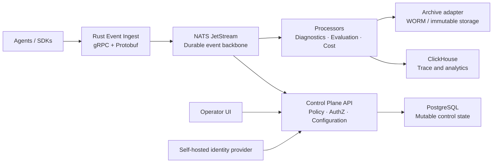

# Apex Agent Control Plane

Apex is a self-hosted control plane for AI agents. It is cloud-agnostic.

Apex helps teams observe, govern, evaluate, secure, and control agent workloads. It runs on local hosts, on-premises systems, and cloud systems. Each agent action is a scoped event. Security, compliance, and cost controls stay near the runtime.

> **Status:** Phase 0, the out-of-band control gateway (cooperative controls plus a supervisor-enacted `force_stop`), the Rust workspace and shared crates, durable admission/fanout separation, and the Apex governance contract boundary are complete. The thin TypeScript MCP gateway in `apps/mcp-gateway` exposes one read-only `portfolio.read` tool, and its live authorization/event path through `control-plane-api` and `event-ingest` has passed the narrow vertical-slice gate. The active milestone is now the managed MCP proxy platform: one hardened isolated container per proxy, with lifecycle and governance controls in the operator UI. The operator UI has a real `MCP proxies` route that talks to the control-plane browser edge, but the rest of the UI is still a placeholder shell, and a usable managed product is not delivered yet. All other roadmap work remains on hold. See the [Apex execution roadmap](docs/roadmap.md).

## What Apex provides

- A GUI-first console for fleets, traces, workflows, evaluations, incidents, policies, compliance, and cost.
- Durable event ingest for runs, model calls, tool calls, decisions, errors, evaluations, memory activity, and workflow topology.
- Secure agent onboarding with scoped configuration, short-lived workload identity, policy preflight, and framework-neutral SDK instrumentation.
- Multi-tenancy with this scope order: installation → workspace → namespace → AgentGroup → agent → run.
- Self-hosted identity and least-privilege access. One installation owner. Scoped roles. OIDC, LDAP/AD, Google Workspace, and Microsoft Entra ID federation.
- Immutable deep diagnostic reports that you can prepare for safe AI-assisted troubleshooting.
- A portable archive boundary for WORM storage: S3/MinIO Object Lock, Azure Blob immutability, and GCS retention. The same archive-provider API is used. The gateway does not import cloud SDKs.
- Cost Lens for accounting, budgets, forecasts, allocation, and self-hosted infrastructure pricing.
- Optional Valkey for rate limits, abuse counters, redacted cache, and live UI fan-out. Valkey is not an authority for audit, access, control, or durable events.

## Getting started

If you are new, open **[Getting started](docs/getting-started.md)**.

That guide covers:

1. Local demo (about 5 minutes).
2. Lab install (signed bundles and trust pack).
3. Live mTLS.
4. Gateway with reference providers.
5. Environment gates (`deploy/compose/e2e/run_gates.py`).
6. Hardened Compose.

Prove deploy-time gates on a machine with Docker:

```bash
python3 deploy/compose/e2e/run_gates.py
```

See [docs/environment-gates.md](docs/environment-gates.md).

Also see [Phase 0 progress](docs/phase-0-progress.md) and [Phase 0.5 progress](docs/phase-0.5-progress.md) (out-of-band control gateway). The minimum runtime structure an agent must implement to connect safely is in [Agent_Structure.md](Agent_Structure.md).

Documentation style: [ASD-STE100 Simplified Technical English](docs/writing-style-ste100.md).

## Operator UI preview

The operator UI is a local React 19 + TypeScript + Vite application. Only the `MCP proxies` routes (`/mcp-proxies`, `/mcp-proxies/new`, `/mcp-proxies/$proxyId`) call a backend: they use a typed `@apex/contracts` client against the optional browser edge that the `control-plane-api` binary can serve (session, logout, and `McpProxyService` management calls; see [docs/operations/mcp-browser-edge.md](docs/operations/mcp-browser-edge.md)). That browser edge is a development checkpoint with Keycloak login and PostgreSQL-backed sessions, not a published production surface. Every other route (agent groups, events, findings, evidence, retention, deployment, settings) is a placeholder with an explicit empty state and calls nothing.

```bash
cd apps/operator-ui
pnpm install
pnpm dev
```

Open `http://127.0.0.1:4173`. Without a running control-plane browser edge, the `MCP proxies` routes show their unauthenticated state and the reserved routes show empty states. See [apps/operator-ui/README.md](apps/operator-ui/README.md).

## Home test in five minutes

This path does not need Docker or credentials. It runs the Python SDK reference loop. It writes validated, hash-chained events to a JSONL file.

```powershell
python -m pip install -e packages/sdk-python
python examples/reference-agent/run_demo.py
Get-Content .local/apex/events.jsonl -Wait
```

The demo emits turn, model, tool, message, child-agent, and completion events. Prompt and tool content are hashes. You can inspect the local trace safely.

The durable Compose profile is a separate hardened path. See [deploy/compose/README.md](deploy/compose/README.md).

### Lab install (Windows, Linux, macOS)

Lab install creates:

- Bundle signing keys
- Agent trust pack
- Optional live-mTLS PKI
- A demo signed bundle

**Windows**

```powershell
powershell -NoProfile -ExecutionPolicy Bypass -File deploy\lab\install.ps1
$env:PYTHONPATH = "packages\sdk-python\src"
python .local\apex-lab\agents\lab-demo\connect_example.py
```

**Linux and macOS**

```bash
chmod +x deploy/lab/install.sh
./deploy/lab/install.sh
export PYTHONPATH=packages/sdk-python/src
python3 .local/apex-lab/agents/lab-demo/connect_example.py
```

See [deploy/lab/README.md](deploy/lab/README.md). Output is in `.local/apex-lab/` (git ignores this path).

## Connection options

Apex supports the paths below. **Implemented** means the client or boundary is present and tested. You may still need deployment wiring.

| Connection | Protocol and authentication | Data that crosses the boundary | Status |
|---|---|---|---|
| Reference agent → local trace | Python SDK; in-process observer; JSONL file | Validated, hash-chained event envelopes with safe content form | Runnable now |
| Agent bundle (`apex-agent.yaml`) | Ed25519-signed JSON; trust keys via `APEX_BUNDLE_TRUST_KEYS_DIR` | Non-secret scope, endpoint refs, allowlists; verify before SPIFFE | Sign and verify in SDK; required for staging and production |
| Agent/SDK → Apex ingest | gRPC + Protobuf `EventIngest.Ingest`; bearer or workload auth; TLS | Scoped event envelopes; size, schema, and idempotency checks | Boundary and runnable gateway implemented |
| Ingest → NATS JetStream | Async NATS over `tls://`; mutual TLS; bounded timeouts | Opaque canonical event bytes; scope-safe subjects; `Nats-Msg-Id` | Client and live-mTLS Compose path implemented |
| Ingest → ClickHouse projection | Authenticated HTTPS POST; mTLS; optional bearer | Canonical event bytes; `X-Apex-Event-Id` | Client, reference provider, live-mTLS, gateway-ref |
| Ingest → archive staging | Authenticated HTTPS PUT; mTLS; optional bearer; create-only keys | One event per event-id key; `If-None-Match: *` | Client and reference provider; backends: local, S3/MinIO, Azure Blob, GCS |
| Operators → operator UI | Local React 19 + Vite app; same-origin browser edge served by `control-plane-api` (Keycloak login, cookie session, CSRF token); the browser is not an authorization boundary | `MCP proxies` list, creation wizard, detail, and activity views over `McpProxyService`; all other routes are placeholders | MCP proxy routes wired to the browser edge (development checkpoint); everything else is a placeholder shell |
| Operators → control-plane API (OOB commands) | gRPC over mTLS; operator credential (Keycloak JWT in production, static token table in lab/CI) independent of the ingest data path | `stop` / `pause` / `resume` / `inject` / `set_budget` cooperative controls (ADR-0005) plus `force_stop` behind two-operator approval, canonicalized into `control` events, durable command outbox (ADR-0006) | Implemented, including bulk submit, list, status, and cancel |
| Agent / supervisor → control-plane API (command retrieval) | gRPC `PollCommands` / `AckCommand`; mTLS client certificate pinned to a bearer token, a third credential space distinct from ingest and operator credentials; file-backed revocation list | Per-command delivery state; the Python SDK reference runtime enacts the five cooperative controls, `apps/agent-supervisor` enacts `force_stop` by killing the agent's process group | Implemented and proven live over a real poll loop |
| MCP client → MCP gateway → Apex | MCP stdio (local) or managed Streamable HTTP; gateway authorizes through `control-plane-api` and admits metadata-only tool evidence through `event-ingest` over mTLS | One read-only `portfolio.read` tool; strict input validation, exact-scope authorization, gateway-side field filtering, no raw prompts or full records | Local/test path and live path proven for the narrow slice; managed production startup fails closed until runtime enforcement is connected |

The gateway's file-based bearer credential (`APEX_FILE_BEARER_MODE=single-agent-staging`, required and explicit — there is no default-on path) binds one shared token to exactly one workload identity, scope set, and pinned client certificate. It is a single-agent staging fallback, not a multi-tenant credential store: do not point more than one agent identity at the same gateway through this path. Real multi-agent and multi-tenant fleets use SPIFFE/SPIRE workload identity instead (see [Frictionless Secure Agent Integration](docs/architecture/Frictionless%20Secure%20Agent%20Integration.md)).

### Compose and reference deployment state

- **Live mTLS harness** (`deploy/compose/live-mtls/`): creates PKI; runs Valkey, NATS, and reference HTTPS providers; Rust `live_mtls` tests use real TLS clients. CI: `.github/workflows/live-mtls-e2e.yml`.
- **E2E script** (`deploy/compose/e2e/run.ps1`): live-mTLS clients, Postgres smoke, MinIO Object-Lock acceptance, optional Azure/GCS acceptance.
- **Gateway and reference providers** (`compose.gateway-ref.yaml`, `gateway-ref/run.ps1`): builds `ingest-gateway`; fans out to JetStream and reference CH/archive over mTLS. Local and CI only. Not a substitute for digest-pinned production images.
- **Overlays** (same style as `compose.valkey.yaml`):
  - `compose.valkey.yaml` — Valkey acceleration
  - `compose.azure.yaml` — archive-provider → Azure Blob
  - `compose.gcs.yaml` — archive-provider → GCS
  - Env keys are in `deploy/compose/.env.example`
- **Production Compose** (`compose.yaml`): `clickhouse-projection` and `archive-provider` need operator digest-pinned images; `archive-store-init` gates Object-Lock; run `preflight.ps1` or `preflight.sh` before start.
- **Control-plane overlays**: `compose.control-pg.yaml` (Postgres-backed command inbox/outbox for multi-replica `control-plane-api`), `compose.control-valkey.yaml` (distributed admission rate limiting), `compose.control-keycloak.yaml` (Keycloak operator credentials).
- **MCP proxy fixture** (`compose.mcp-proxy.yaml`, `mcp-proxy-test/`): builds the `apps/mcp-gateway` image and starts one managed `portfolio.read` proxy plus a test upstream. It is a bootstrap/startup-refusal fixture for the active roadmap slice, not a ready deployment.
- **Cold-storage tier** (`compose.coldstore.yaml`) and **CI cache** (`compose.ci-cache.yaml`) overlays; a `working-browser/` topology for the operator-UI browser-edge journey.
- **PostgreSQL** outbox and idempotency adapters exist behind the `event-ingest` `postgres` feature, and the `control-plane-api` `postgres` feature provides the multi-replica-authoritative command inbox/outbox. Compose E2E starts Postgres for smoke tests.

For local work, start with the reference agent. For a production-like path, use live-mTLS or gateway-ref, or use pinned images from the [Compose profile](deploy/compose/README.md). Cloud SDKs stay in the archive-provider process only.

Storage contracts: [deploy/clickhouse/schema.sql](deploy/clickhouse/schema.sql), [contracts/clickhouse/v1.md](contracts/clickhouse/v1.md), [contracts/archive-provider/v1.md](contracts/archive-provider/v1.md).

External agent procedure: [How to connect an external agent for event ingestion](docs/how-to-external-event-ingestion.md).

## Docker images

Apex runs as several small containers. No image does more than one job. The definitive topology is [deploy/compose/compose.yaml](deploy/compose/compose.yaml); this table explains what each service does and why it exists.

| Service | Built from | What it handles |
|---|---|---|
| `ingest-gateway` | `apps/event-ingest/Dockerfile` (Rust) | The only entry point for agent events. Terminates gRPC and mTLS. Authenticates the caller. Validates and canonicalizes each event, commits it to a durable local outbox, and acknowledges the caller. A separate replay worker then fans the event out to JetStream, the ClickHouse projection, and the archive with idempotent retry, so a downstream outage cannot block admission. |
| `control-plane-api` | `apps/control-plane-api/Dockerfile` (Rust) | The out-of-band control gateway. Accepts operator commands over mTLS, gates `force_stop` behind two distinct approvals, records each command in a durable outbox and per-target delivery inbox, and serves `PollCommands`/`AckCommand` to agents and supervisors under a separate credential space. Optionally serves the loopback browser edge for the operator UI. |
| `mcp-gateway` *(`compose.mcp-proxy.yaml` overlay)* | `apps/mcp-gateway/Dockerfile` (TypeScript) | One managed MCP proxy per container. Exposes `portfolio.read`, authorizes through `control-plane-api`, filters fields, and admits metadata-only evidence through `ingest-gateway`. Managed startup refuses to run until live enforcement is connected. |
| `jetstream` | Approved NATS image | The durable event backbone between the gateway and its consumers. Holds events so a slow or restarting consumer does not lose data. |
| `clickhouse` | Approved ClickHouse image | Stores the queryable event table. Nothing writes to it directly except the `clickhouse-projection` service. |
| `clickhouse-projection` | `apps/reference-providers/Dockerfile` (Python), run in `clickhouse_projection` mode | A narrow write API in front of ClickHouse. Accepts an event only over mTLS from the one pinned client certificate the ingest gateway presents. Refuses every other caller. |
| `archive-provider` | The same `apps/reference-providers/Dockerfile`, run in `archive_provider` mode instead | The compliance write path. Accepts one event per object, applies Object-Lock retention, and reads the object back to confirm the write and the lock both took effect before acknowledging. Refuses to overwrite or accept an unlocked write. |
| `archive-store` | Approved MinIO (or other S3-compatible) image | The object storage backing the archive. Holds the actual immutable event objects. |
| `archive-store-init` | Approved MinIO client (`mc`) image | Runs once, before anything else writes. Creates the archive bucket with Object-Lock enabled and verifies retention is actually active. Exits; does not stay running. |
| `valkey` *(optional overlay)* | Approved Valkey image | Accelerates rate-limit and abuse-counter checks across gateway restarts. Never the source of truth for authorization, audit, or durable events — the gateway keeps working correctly if this is absent. |

`clickhouse-projection` and `archive-provider` are the same built image, `apex-reference-providers`, given different roles by the command-line subcommand each service passes at startup (`clickhouse_projection` or `archive_provider`) — not two separate codebases to maintain.

Every service above drops all Linux capabilities and mounts its filesystem read-only except for an explicit data volume or `/tmp`. `ingest-gateway` and `control-plane-api` also run as fixed non-root UIDs (`apps/event-ingest/Dockerfile`, `apps/control-plane-api/Dockerfile`). `clickhouse-projection` and `archive-provider` do not: `apps/reference-providers/Dockerfile` has no `USER` directive and `compose.yaml` does not override it, so both currently run as root — a known hardening gap, not a deliberate choice, worth closing before either is treated as production-hardened rather than a reference implementation. Every service-to-service link is mTLS regardless; `clickhouse-projection` and `archive-provider` pin the exact client certificate fingerprint they accept and fail closed on anything else. See [Security and regulated deployment posture](#security-and-regulated-deployment-posture).

`apps/agent-supervisor` is not a Compose service: one instance runs per supervised agent, wrapping the agent as its own OS child in a separate process group and holding a credential the agent never sees. The operator UI (`apps/operator-ui`) remains a local dev server rather than a container. UI work beyond the `MCP proxies` surface remains on hold.

## Design principles

1. **Secure by default.** Deny-by-default authorization. Workload identity. Encrypted transport. Minimal capture. Auditable decisions. Safe display of untrusted content.
2. **Cloud agnostic.** No mandatory SaaS control plane. No mandatory cloud billing dependency. Run the same product locally, on K3s, or on Kubernetes.
3. **Scale without a rewrite.** Durable events, idempotency, namespace isolation, and HA-capable boundaries are first-class.
4. **GUI first, API complete.** Each primary operation has a visual path and an audited API.
5. **Evidence over claims.** Apex supports technical controls and evidence collection. Your organization owns deployment risk, contracts, and certifications.
6. **Cost truthfulness.** Actual, reconciled, estimated, allocated, and forecast cost are distinct. Ledger history is not overwritten.

## Target architecture



| Area | Initial technology |
|---|---|
| Core services | Rust, Tokio, tonic gRPC, Protobuf |
| Durable event transport | NATS JetStream |
| Control state | PostgreSQL |
| Trace analytics | ClickHouse |
| Human identity | Keycloak |
| Workload identity | SPIFFE/SPIRE |
| Kubernetes cost allocation | Optional OpenCost |
| Deployment | Compose, K3s/Kubernetes, Helm |
| Operator experience | React 19 + TypeScript + Vite in `apps/operator-ui` |
| MCP data plane | TypeScript (`@modelcontextprotocol/sdk`) in `apps/mcp-gateway`; shared wire types in `packages/apex-contracts-ts` |

## Repository layout

```text
apps/
  agent-supervisor/        Per-run process supervisor that enacts non-cooperative `force_stop` by process-group kill
  control-plane-api/       Out-of-band command gateway (stop/pause/resume/inject/set_budget/force_stop), MCP proxy management, optional browser edge
  event-ingest/            gRPC ingestion, event validation, durable outbox, replay fanout
  mcp-gateway/             Thin TypeScript MCP gateway; read-only `portfolio.read`; managed proxy runtime image
  operator-ui/             React operator console; `MCP proxies` routes are live, other routes are placeholders
  proxy-runtime-agent/     Rust wire/inspection boundary for managed proxy runtimes (no listener or provisioning yet)
  reference-providers/     Python mTLS reference ClickHouse-projection and archive-provider services for local/CI
crates/
  apex-contract/           Generated Protobuf types and contract compatibility evidence
  apex-domain/             Scope model, identifiers, validation, domain errors
  apex-auth/               Credential verification and non-authoritative ephemeral acceleration (rate limits, Valkey/memory)
  apex-policy/             Apex governance contracts: authorization, policy, approval, tool evidence
  apex-security/           Security Alerts and deterministic detectors
  apex-durability/         Outbox, idempotency, and fanout foundations
  apex-telemetry/          Integer clock primitives for microsecond-precision telemetry
packages/
  apex-contracts-ts/       TypeScript Protobuf types shared by the MCP gateway and operator UI
  sdk-python/              Python SDK for agents, including the reference control-channel runtime
contracts/
  proto/apex/v1/           Versioned protobuf API and event contracts (event, control, governance, MCP proxy)
  jsonschema/              JSON schemas for configuration and policies
  clickhouse/, archive-provider/, postgres-*.md   Storage provider contracts
deploy/
  compose/                 Single-host deployment, CI/dev overlays, live-mTLS harness, E2E gates
  lab/                     Lab installer (Windows, Linux, macOS)
  clickhouse/, postgres/   Schemas
docs/
  architecture/            Architecture decisions and diagrams
  security/                Threat models, Security Alerts, hardening reviews
  operations/              Durability, browser edge, MCP proxy operations and evidence ledgers
  superpowers/             Approved design specs and execution plans
  roadmap.md               Execution source of truth
  getting-started.md       Day-one operator and developer guide
examples/
  reference-agent/         Small observable reference agent
scripts/                   Developer and CI automation (lab-only-settings gate, line-limit check, browser/Keycloak prep)
```

Helm charts, Kubernetes manifests, a cost ledger, and a diagnostics crate are planned but do not exist in the repository yet.

## Operator experience

- **Operations Home:** fleet health, active incidents, policy posture, and cost changes.
- **Fleet Canvas:** live namespace and AgentGroup topology.
- **Agent Story:** human-scale runtime map and playback for one agent or run from actual events.
- **Trace Explorer:** redacted runs, turns, tools, models, decisions, memory, and failures.
- **Compliance Center:** readiness, evidence, policy exceptions, retention, and audit exports.
- **Policy Studio:** guided policies, scope simulation, approvals, and version history.
- **Evaluation Lab:** evaluation flows, regression gates, and quality, cost, and latency comparisons.
- **Cost Lens:** per-run, hourly, daily, weekly, monthly, yearly, and forecast views.
- **Incident Panel:** causal deep-error reports and safe AI diagnostic bundles.
- **Security Center:** scoped alerts and safe containment workflows.

## Security and regulated deployment posture

- OIDC Authorization Code + PKCE for users. Apex does not manage human passwords.
- One immutable installation owner. Then scoped built-in or custom roles from atomic permissions.
- SPIFFE workload identities and mutual TLS for service-to-service access.
- Namespace isolation, classification-aware policy, transport encryption, and externalized runtime secrets.
- Non-root and read-only containers. Signed and pinned images. SBOMs. Vulnerability gates. Supply-chain verification.
- CI runs static analysis and dependency-vulnerability scanning on every push: `cargo audit` and `cargo deny` (advisories, license policy, banned/duplicate crates) for each of the three Rust binaries, `bandit` and `pip-audit` for the Python SDK, a gateway-contract compatibility check, a 600-line source-file limit, and a lab-only-settings gate.
- Strict ingest limits and schema validation. Safe text-only display of untrusted content.
- Isolated tool execution: deny-by-default egress, per-tool identity, resource limits, no host or Docker socket access.
- Append-only audit and cost ledgers. Corrections are linked adjustments, not overwrites.
- Strict archive profiles need proof of retention, legal hold, retrieval, and verification.

Raw payment-card data is out of scope for the first release. Regulated profiles support technical controls and evidence. They do not replace your compliance duties.

## Cost Lens

Cost Lens measures provider and model, tool and API, evaluation, infrastructure, data-lifecycle, and optional business-allocation cost. It supports scopes from request through workspace and cost center. It supports live through yearly periods.

It includes usage and token accounting, requested versus effective model attribution, retries and fallbacks, infrastructure cost, actual versus estimated labels, scoped budgets, pre-run cost envelopes, cache ROI, retry waste, cost attribution hygiene, and safe what-if scenarios.

## Build order

The former build order is superseded. Follow the [Apex execution roadmap](docs/roadmap.md). The Rust workspace, durable admission/fanout separation, Apex governance contracts, the thin TypeScript MCP gateway, and the narrow live `portfolio.read` vertical slice are complete. The active milestone is the managed MCP proxy platform: versioned proxy resources in the control-plane contract, one hardened isolated container per proxy, and create/deploy/pause/rotate/rollback/retire workflows in the operator UI. Its first acceptance slice is a read-only `portfolio.read` proxy running through an isolated runtime and appearing in the operator UI as server-derived activity. Everything else remains paused until that gate passes.

## Contributing

Until more services are complete, keep these boundaries:

- Put shared API and event changes in `contracts/proto/apex/v1` first.
- Keep cloud and archive vendors behind explicit provider interfaces.
- Add contract, negative-path security, and scope-isolation tests with each feature.
- Do not add a required managed service when a self-hosted component meets the need.

Write product documentation in [ASD-STE100 Simplified Technical English](docs/writing-style-ste100.md).

## License

License selection is pending. Do not assume a license grant until a license file is added to this repository.
