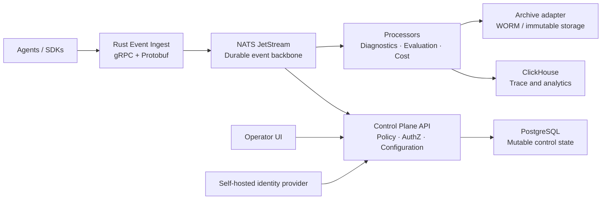

# Apex Agent Control Plane

A self-hosted, cloud-agnostic control plane for operating AI agents safely at scale.

Apex gives teams a visual way to observe, govern, evaluate, secure, and control agent workloads across local, on-premises, and cloud environments. Every agent action is a scoped, traceable event; operational, security, compliance, and cost controls stay close to the runtime.

> **Status:** Phase 0 is active. The event contract, Python SDK, tested ingest-admission core, safe diagnostics, fail-closed runnable ingest gateway, and the first immutable Security Alerts finding foundation are complete foundations. Compose now includes authenticated ClickHouse/archive provider slots and an Object-Lock bootstrap gate; approved provider images, real mTLS credentials, end-to-end Compose replay tests, detector integration, and secure agent enrollment remain in progress.

## What it provides

- A GUI-first console for agent fleets, traces, workflows, evaluations, incidents, policies, compliance, and cost.
- Durable event ingest for agent runs, model calls, tool calls, decisions, errors, evaluations, memory activity, and workflow topology.
- Frictionless secure agent onboarding with generated scope-bound configuration, short-lived workload identity, automatic policy preflight, and framework-neutral SDK instrumentation.
- Kubernetes-style multi-tenancy: installation → workspace → namespace → AgentGroup → agent → run.
- Self-hosted identity and configurable least-privilege access: one installation owner, scoped built-in/custom roles, OIDC, LDAP/AD, Google Workspace, and Microsoft Entra ID federation.
- Immutable deep diagnostic reports that may be safely prepared for AI-assisted troubleshooting.
- A portable archive boundary for WORM/immutable storage, including S3 Object Lock, Azure Immutable Blob Storage, and validated records-management integrations.
- Cost Lens: per-run through yearly accounting, budgets, forecasts, allocation, and self-hosted infrastructure pricing.
- Optional Valkey acceleration for rate limits, security-abuse counters, redacted caching, and live UI fan-out; it is never an authority for audit, access, control, or durable events.

## Phase 0 progress

See [Phase 0 progress](docs/phase-0-progress.md) for the completed foundations, security boundaries, verification commands, end-to-end harness, and remaining work before the local durable event path is runnable against real providers.

## Home test in five minutes

The easiest local path does not require Docker or credentials. It runs the real Python SDK reference loop and writes validated, hash-chained events to a safe JSONL trace:

```powershell
python -m pip install -e packages/sdk-python
python examples/reference-agent/run_demo.py
Get-Content .local/apex/events.jsonl -Wait
```

The demo emits turn, model, tool, message, child-agent, and completion events. Prompt and tool content is represented by hashes, so the local trace is safe to inspect and share. The durable Compose profile is a separate, hardened dependency environment; see [deploy/compose/README.md](deploy/compose/README.md) for its certificate and image requirements.

## Connection options

The current Phase 0 foundations support the following connection paths. “Implemented” means the client or boundary is present and tested; deployment wiring and provider-specific schemas may still be required.

| Connection | Protocol and authentication | What crosses the boundary | Status |
|---|---|---|---|
| Reference agent → local trace | Python SDK; in-process observer and JSONL file | Validated, hash-chained event envelopes with content represented safely | **Runnable now** |
| Agent/SDK → Apex ingest | gRPC + Protobuf `EventIngest.Ingest`; bearer/workload verification and TLS at deployment | Scoped event envelopes, with size, schema, and idempotency checks | **Boundary implemented; service packaging remains** |
| Ingest → NATS JetStream | Async NATS over `tls://`; mutual TLS, bounded reconnect/request/ack timeouts | Opaque canonical event bytes; scope-safe subjects and `Nats-Msg-Id` | **Client and Compose gateway wiring implemented** |
| Ingest → ClickHouse | Authenticated HTTPS POST; mTLS plus optional file-backed bearer token | Canonical event bytes and `X-Apex-Event-Id` for correlation/idempotency | **Client implemented; schema/provider endpoint is deployment-specific** |
| Ingest → archive staging | Authenticated HTTPS PUT; mTLS plus optional file-backed bearer token | One event per event-id object key with create-only `If-None-Match: *` semantics | **Client implemented; Object Lock/immutability verification remains** |
| Operators/agents → control-plane API and UI | Planned API/UI session and workload connections | Configuration, policy, diagnostics, evaluations, and operational commands | **Planned after the Phase 0 durable path** |

### Current Compose deployment state

The ClickHouse and archive rows above describe the client seams; the current
deployment status is that their internal Compose provider slots are wired but
still require approved provider images, mTLS certificates, backend credentials,
and real Compose acceptance tests.

- `clickhouse-projection` and `archive-provider` are internal-only service
  slots. They require approved digest-pinned provider images implementing the
  frozen authenticated APIs; native ClickHouse and MinIO are backend services,
  not Apex provider endpoints.
- `archive-store-init` creates and verifies the configured Object-Lock bucket
  over TLS before the archive provider is allowed to start. Strict retention
  remains disabled until the provider acceptance suite independently verifies
  retention, legal holds, version identifiers, read-after-write, and content
  integrity.
- Compose requires separate mTLS material and least-privilege archive backend
  credentials. Private keys are mounted read-only with `0400` permissions.
- Run `preflight.ps1` on Windows or `preflight.sh` on Linux/macOS before
  starting services. These checks reject placeholders, missing secrets,
  unpinned images, invalid Object-Lock settings, and unavailable Docker
  daemons without printing secret values.
- The Rust `e2e_path` harness drives a real gRPC server through the JetStream,
  ClickHouse, and archive seams and verifies restart replay and conflict
  preservation. Real Compose E2E execution still requires the provider images,
  certificates, and Docker daemon.

For a local setup, start with the reference agent above. For a production-like path, provision trusted certificates and pinned dependency images from the [Compose profile](deploy/compose/README.md), then connect the Rust ingest gateway to NATS and the authenticated ClickHouse/archive endpoints. The HTTPS archive client is a staging boundary; it does not by itself prove WORM retention or legal hold.

Not every architecture box is connected yet: PostgreSQL control state, provider image deployment, real Compose acceptance/replay execution, and the operator UI/API remain on the Phase 0 follow-up list. Keep vendor-specific URLs, schemas, and credentials behind the explicit provider interfaces rather than placing them in the shared event contract.

The storage contracts are documented in [deploy/clickhouse/schema.sql](deploy/clickhouse/schema.sql), [contracts/clickhouse/v1.md](contracts/clickhouse/v1.md), and [contracts/archive-provider/v1.md](contracts/archive-provider/v1.md). The ClickHouse table is an analytical projection; the archive-provider contract is the immutable-record boundary.

For the external agent connection procedure, see [How to connect an external agent for event ingestion](docs/how-to-external-event-ingestion.md).

## Design principles

1. **Secure by default:** deny-by-default authorization, workload identity, encrypted transport, minimal capture, auditable decisions, and safe rendering of untrusted content.
2. **Cloud agnostic:** no mandatory SaaS control plane or cloud billing dependency; run the same product locally, on K3s, or Kubernetes.
3. **Scale without a rewrite:** durable events, idempotency, namespace isolation, and HA-capable service boundaries are first-class.
4. **GUI first, API complete:** every primary operation has a visual experience and an audited API.
5. **Evidence over claims:** Apex supports technical controls and evidence collection; each organization remains responsible for its deployment, risk assessment, contracts, and certifications.
6. **Cost truthfulness:** actual, reconciled, estimated, allocated, and forecast cost are visibly distinct; ledger history is never overwritten.

## Target architecture



| Area | Initial technology |
|---|---|
| Core services | Rust, Tokio, tonic gRPC, Protobuf |
| Durable event transport | NATS JetStream |
| Control state | PostgreSQL |
| Trace analytics | ClickHouse |
| Human identity | Keycloak |
| Workload identity | SPIFFE/SPIRE |
| Kubernetes cost allocation | Optional OpenCost |
| Deployment | Compose, K3s/Kubernetes, Helm |
| Operator experience | React 19 + TypeScript + Vite application in `apps/operator-ui` |

## Repository layout

```text
apps/
  control-plane-api/       Control API, policy decisions, configuration, realtime updates
  event-ingest/            gRPC ingestion and event validation
  operator-ui/             Operations, compliance, evaluation, and Cost Lens GUI
crates/
  domain/                  Shared domain types and scope model
  event-contract/          Protobuf envelope, schema evolution, validation
  policy-engine/           Policies, admission, approval logic
  authz/                   Role, permission, and scope evaluation
  cost-ledger/             Immutable ledger, rate cards, allocation, budgets
  archive-provider/        Portable immutable/WORM archive adapters
  diagnostics/             Deep error reports and safe diagnostic bundles
packages/
  sdk-python/              Python SDK for agents and evaluation workloads
contracts/
  proto/apex/v1/           Versioned protobuf API and event contracts
  jsonschema/              JSON schemas for configuration and policies
config/
  profiles/                Deployment and compliance profiles
  policies/                Versioned policy examples and defaults
  pricebooks/              Self-hosted and provider rate-card examples
deploy/
  compose/                 Single-host deployment
  helm/apex/               Helm chart
  kubernetes/base/         Kubernetes base manifests
  kubernetes/overlays/     Self-hosted and HA overlays
docs/
  architecture/            Architecture decisions and diagrams
  api/                     API and event documentation
  security/                Threat model, controls, hardening
  operations/              Runbooks, backup/restore, deployment guidance
examples/
  reference-agent/         Small observable reference agent
  evaluation-flow/         Deterministic and judge-based evaluation example
tests/
  contract/                Contract compatibility tests
  integration/             Service, storage, archive-adapter tests
  e2e/                     GUI-to-control-plane tests
  security/                Authorization, abuse, fuzz, negative-path tests
scripts/                   Developer and CI automation
tools/                     Internal development tooling
```

## Operator experience

- **Operations Home:** fleet health, active incidents, policy posture, and cost changes.
- **Fleet Canvas:** live namespace and AgentGroup topology.
- **Agent Story:** a click-through, human-scale runtime map and playback of one agent/run—its loop, model/effort, tools, memory, child agents, policy, cost, and security state—from actual events.
- **Trace Explorer:** redacted runs, turns, tools, models, decisions, memory, and failures.
- **Compliance Center:** readiness, evidence, policy exceptions, retention, and audit exports.
- **Policy Studio:** guided policies, scope simulation, approvals, and version history.
- **Evaluation Lab:** evaluation flows, regression gates, and quality/cost/latency comparisons.
- **Cost Lens:** per-run, hourly, daily, weekly, monthly, yearly, and forecast views.
- **Incident Panel:** causal deep-error reports and safe AI diagnostic bundles.
- **Security Center:** scoped prompt-injection, malicious-tool, data-exposure, identity-abuse, and telemetry-integrity alerts with safe containment workflows.

## Security and regulated deployment posture

- OIDC Authorization Code + PKCE for users; Apex does not manage human passwords.
- One immutable installation owner, then scoped built-in or custom roles based on atomic permissions.
- SPIFFE workload identities and mutual TLS for service-to-service access.
- Namespace isolation, classification-aware policy, transport encryption, and externalized runtime secrets.
- Non-root/read-only containers; signed and pinned images, SBOMs, vulnerability gates, and supply-chain verification.
- Strict ingestion limits/schema validation and safe text-only rendering of untrusted agent, tool, and diagnostic content.
- Isolated tool execution: denied-by-default egress, per-tool identity, resource limits, and no host/Docker socket access.
- Append-only audit/cost ledgers. Corrections are linked adjustments, not overwrites.
- Strict archive profiles require proof of retention, legal-hold, retrieval, and verification capabilities.

Raw payment-card data is intentionally out of scope for the initial release. Regulated deployment profiles provide technical controls and evidence support; they do not replace organizational compliance responsibilities.

## Cost Lens

Cost Lens measures provider/model, tool/API, evaluation, infrastructure, data-lifecycle, and optional business-allocation cost across every scope. It supports per-request, run, trace, agent, AgentGroup, namespace, workspace, cost center, model, tool, and evaluation—across live, hourly, daily, weekly, monthly, quarterly, and yearly periods.

It includes usage and token accounting, requested-versus-effective model/reasoning-effort attribution, retries/fallbacks, CPU/RAM/GPU/storage/network/archive costs, actual-versus-estimated labeling, scoped budgets, pre-run cost envelopes, cache ROI, retry waste, cost attribution hygiene, and safe what-if scenarios.

## Build order

1. Implement the accepted [telemetry and control semantics](docs/architecture/Telemetry%20and%20Control%20Semantics.md): versioned contracts, scope model, idempotency, classification, policy, command lifecycle, and security-sensitive field handling.
2. Build Rust ingest, NATS JetStream, PostgreSQL control state, ClickHouse analytics, and the Python SDK.
3. Deliver frictionless secure agent enrollment, identity, authorization, policy profiles, audit evidence, archive-provider contracts, and the security test harness.
4. Build the core GUI: Operations Home, Agent Story, Trace Explorer, Cost Lens actuals, diagnostics, and Compliance Center.
5. Add Security Center, deterministic alerting/containment, HA deployment, workload mTLS, custom roles, approvals, and continuous policy monitoring.
6. Add evaluation/replay, forecasts, anomaly detection, fleet visualization, correlated security detection, and advanced operations.

## Contributing

Until executable services arrive, preserve these boundaries:

- Put shared API/event changes in `contracts/proto/apex/v1` first.
- Keep cloud and archive vendors behind explicit provider interfaces.
- Add contract, negative-path security, and scope-isolation tests with every feature.
- Do not add a required managed service when a well-supported self-hosted component satisfies the requirement.

## License

License selection is pending. Do not assume a license grant until one is added to this repository.
