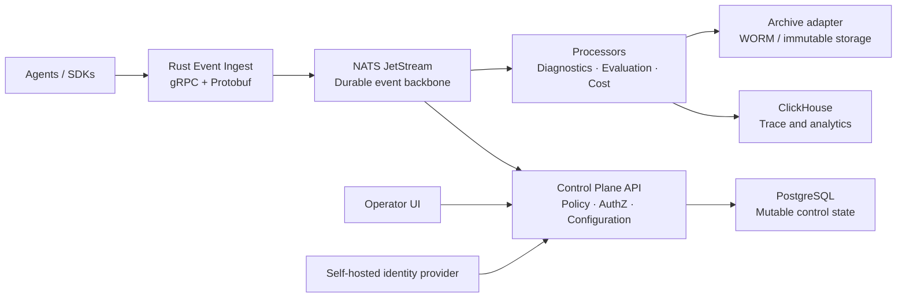

# Apex Agent Control Plane

Apex is a self-hosted control plane for AI agents. It is cloud-agnostic.

Apex helps teams observe, govern, evaluate, secure, and control agent workloads. It runs on local hosts, on-premises systems, and cloud systems. Each agent action is a scoped event. Security, compliance, and cost controls stay near the runtime.

> **Status:** Phase 0 is complete. It delivers the event contract, Python SDK (`Apex.connect`, gold-standard template, model execution attribution), hardened ingest admission, Security Alerts, durable outbox and fanout seams, storage contracts, and Compose provider slots. Phase 1 has started with the React operator UI scaffold; its live control-plane API, authenticated sessions, and server-derived data remain Phase 1 work. See [Phase 0 progress](docs/phase-0-progress.md).

## What Apex provides

- A GUI-first console for fleets, traces, workflows, evaluations, incidents, policies, compliance, and cost.
- Durable event ingest for runs, model calls, tool calls, decisions, errors, evaluations, memory activity, and workflow topology.
- Secure agent onboarding with scoped configuration, short-lived workload identity, policy preflight, and framework-neutral SDK instrumentation.
- Multi-tenancy with this scope order: installation → workspace → namespace → AgentGroup → agent → run.
- Self-hosted identity and least-privilege access. One installation owner. Scoped roles. OIDC, LDAP/AD, Google Workspace, and Microsoft Entra ID federation.
- Immutable deep diagnostic reports that you can prepare for safe AI-assisted troubleshooting.
- A portable archive boundary for WORM storage: S3/MinIO Object Lock, Azure Blob immutability, and GCS retention. The same archive-provider API is used. The gateway does not import cloud SDKs.
- Cost Lens for accounting, budgets, forecasts, allocation, and self-hosted infrastructure pricing.
- Optional Valkey for rate limits, abuse counters, redacted cache, and live UI fan-out. Valkey is not an authority for audit, access, control, or durable events.

## Getting started

If you are new, open **[Getting started](docs/getting-started.md)**.

That guide covers:

1. Local demo (about 5 minutes).
2. Lab install (signed bundles and trust pack).
3. Live mTLS.
4. Gateway with reference providers.
5. Environment gates (`deploy/compose/e2e/run_gates.py`).
6. Hardened Compose.

Prove deploy-time gates on a machine with Docker:

```bash
python3 deploy/compose/e2e/run_gates.py
```

See [docs/environment-gates.md](docs/environment-gates.md).

Also see [Phase 0 progress](docs/phase-0-progress.md).

Documentation style: [ASD-STE100 Simplified Technical English](docs/writing-style-ste100.md).

## Operator UI preview

The Phase 1 operator UI is a local React application. It currently uses clearly labelled illustrative data. It does not call control-plane, ingest, identity, archive, or policy APIs yet.

```bash
cd apps/operator-ui
pnpm install
pnpm dev
```

Open `http://127.0.0.1:4173`. The preview shows the planned system-map workflow, scoped connection starting point, finding queue, and reserved routes for agent groups, events, evidence, retention, deployment, and settings. See [apps/operator-ui/README.md](apps/operator-ui/README.md).

## Home test in five minutes

This path does not need Docker or credentials. It runs the Python SDK reference loop. It writes validated, hash-chained events to a JSONL file.

```powershell
python -m pip install -e packages/sdk-python
python examples/reference-agent/run_demo.py
Get-Content .local/apex/events.jsonl -Wait
```

The demo emits turn, model, tool, message, child-agent, and completion events. Prompt and tool content are hashes. You can inspect the local trace safely.

The durable Compose profile is a separate hardened path. See [deploy/compose/README.md](deploy/compose/README.md).

### Lab install (Windows, Linux, macOS)

Lab install creates:

- Bundle signing keys
- Agent trust pack
- Optional live-mTLS PKI
- A demo signed bundle

**Windows**

```powershell
powershell -NoProfile -ExecutionPolicy Bypass -File deploy\lab\install.ps1
$env:PYTHONPATH = "packages\sdk-python\src"
python .local\apex-lab\agents\lab-demo\connect_example.py
```

**Linux and macOS**

```bash
chmod +x deploy/lab/install.sh
./deploy/lab/install.sh
export PYTHONPATH=packages/sdk-python/src
python3 .local/apex-lab/agents/lab-demo/connect_example.py
```

See [deploy/lab/README.md](deploy/lab/README.md). Output is in `.local/apex-lab/` (git ignores this path).

## Connection options

Phase 0 supports the paths below. **Implemented** means the client or boundary is present and tested. You may still need deployment wiring.

| Connection | Protocol and authentication | Data that crosses the boundary | Status |
|---|---|---|---|
| Reference agent → local trace | Python SDK; in-process observer; JSONL file | Validated, hash-chained event envelopes with safe content form | Runnable now |
| Agent bundle (`apex-agent.yaml`) | Ed25519-signed JSON; trust keys via `APEX_BUNDLE_TRUST_KEYS_DIR` | Non-secret scope, endpoint refs, allowlists; verify before SPIFFE | Sign and verify in SDK; required for staging and production |
| Agent/SDK → Apex ingest | gRPC + Protobuf `EventIngest.Ingest`; bearer or workload auth; TLS | Scoped event envelopes; size, schema, and idempotency checks | Boundary and runnable gateway implemented |
| Ingest → NATS JetStream | Async NATS over `tls://`; mutual TLS; bounded timeouts | Opaque canonical event bytes; scope-safe subjects; `Nats-Msg-Id` | Client and live-mTLS Compose path implemented |
| Ingest → ClickHouse projection | Authenticated HTTPS POST; mTLS; optional bearer | Canonical event bytes; `X-Apex-Event-Id` | Client, reference provider, live-mTLS, gateway-ref |
| Ingest → archive staging | Authenticated HTTPS PUT; mTLS; optional bearer; create-only keys | One event per event-id key; `If-None-Match: *` | Client and reference provider; backends: local, S3/MinIO, Azure Blob, GCS |
| Operators → operator UI | Local React 19 + Vite preview; the browser is not an authorization boundary | Clearly labelled illustrative topology, connection workflow, and reserved operating routes | Phase 1 scaffold implemented; live API/session integration pending |
| Operators → control-plane API | Planned session and workload connections | Configuration, policy, diagnostics, evaluations, commands | Phase 1 planned |

The gateway's file-based bearer credential (`APEX_FILE_BEARER_MODE=single-agent-staging`, required and explicit — there is no default-on path) binds one shared token to exactly one workload identity, scope set, and pinned client certificate. It is a single-agent staging fallback, not a multi-tenant credential store: do not point more than one agent identity at the same gateway through this path. Real multi-agent and multi-tenant fleets use SPIFFE/SPIRE workload identity instead (see [Frictionless Secure Agent Integration](docs/architecture/Frictionless%20Secure%20Agent%20Integration.md)).

### Compose and reference deployment state

- **Live mTLS harness** (`deploy/compose/live-mtls/`): creates PKI; runs Valkey, NATS, and reference HTTPS providers; Rust `live_mtls` tests use real TLS clients. CI: `.github/workflows/live-mtls-e2e.yml`.
- **E2E script** (`deploy/compose/e2e/run.ps1`): live-mTLS clients, Postgres smoke, MinIO Object-Lock acceptance, optional Azure/GCS acceptance.
- **Gateway and reference providers** (`compose.gateway-ref.yaml`, `gateway-ref/run.ps1`): builds `ingest-gateway`; fans out to JetStream and reference CH/archive over mTLS. Local and CI only. Not a substitute for digest-pinned production images.
- **Overlays** (same style as `compose.valkey.yaml`):
  - `compose.valkey.yaml` — Valkey acceleration
  - `compose.azure.yaml` — archive-provider → Azure Blob
  - `compose.gcs.yaml` — archive-provider → GCS
  - Env keys are in `deploy/compose/.env.example`
- **Production Compose** (`compose.yaml`): `clickhouse-projection` and `archive-provider` need operator digest-pinned images; `archive-store-init` gates Object-Lock; run `preflight.ps1` or `preflight.sh` before start.
- **PostgreSQL** outbox and idempotency adapters exist behind the gateway `postgres` feature. Compose E2E starts Postgres for smoke tests. Full multi-process control-plane API is later work.

For local work, start with the reference agent. For a production-like path, use live-mTLS or gateway-ref, or use pinned images from the [Compose profile](deploy/compose/README.md). Cloud SDKs stay in the archive-provider process only.

Storage contracts: [deploy/clickhouse/schema.sql](deploy/clickhouse/schema.sql), [contracts/clickhouse/v1.md](contracts/clickhouse/v1.md), [contracts/archive-provider/v1.md](contracts/archive-provider/v1.md).

External agent procedure: [How to connect an external agent for event ingestion](docs/how-to-external-event-ingestion.md).

## Design principles

1. **Secure by default.** Deny-by-default authorization. Workload identity. Encrypted transport. Minimal capture. Auditable decisions. Safe display of untrusted content.
2. **Cloud agnostic.** No mandatory SaaS control plane. No mandatory cloud billing dependency. Run the same product locally, on K3s, or on Kubernetes.
3. **Scale without a rewrite.** Durable events, idempotency, namespace isolation, and HA-capable boundaries are first-class.
4. **GUI first, API complete.** Each primary operation has a visual path and an audited API.
5. **Evidence over claims.** Apex supports technical controls and evidence collection. Your organization owns deployment risk, contracts, and certifications.
6. **Cost truthfulness.** Actual, reconciled, estimated, allocated, and forecast cost are distinct. Ledger history is not overwritten.

## Target architecture



| Area | Initial technology |
|---|---|
| Core services | Rust, Tokio, tonic gRPC, Protobuf |
| Durable event transport | NATS JetStream |
| Control state | PostgreSQL |
| Trace analytics | ClickHouse |
| Human identity | Keycloak |
| Workload identity | SPIFFE/SPIRE |
| Kubernetes cost allocation | Optional OpenCost |
| Deployment | Compose, K3s/Kubernetes, Helm |
| Operator experience | React 19 + TypeScript + Vite in `apps/operator-ui` |

## Repository layout

```text
apps/
  control-plane-api/       Control API, policy, configuration, realtime updates
  event-ingest/            gRPC ingestion and event validation
  operator-ui/             Operations, compliance, evaluation, Cost Lens GUI
crates/
  domain/                  Shared domain types and scope model
  event-contract/          Protobuf envelope, schema evolution, validation
  policy-engine/           Policies, admission, approval logic
  authz/                   Role, permission, and scope evaluation
  cost-ledger/             Immutable ledger, rate cards, allocation, budgets
  archive-provider/        Portable immutable/WORM archive adapters
  diagnostics/             Deep error reports and safe diagnostic bundles
packages/
  sdk-python/              Python SDK for agents and evaluation workloads
contracts/
  proto/apex/v1/           Versioned protobuf API and event contracts
  jsonschema/              JSON schemas for configuration and policies
config/
  profiles/                Deployment and compliance profiles
  policies/                Versioned policy examples and defaults
  pricebooks/              Self-hosted and provider rate-card examples
deploy/
  compose/                 Single-host deployment
  lab/                     Lab installer (Windows, Linux, macOS)
  helm/apex/               Helm chart
  kubernetes/base/         Kubernetes base manifests
  kubernetes/overlays/     Self-hosted and HA overlays
docs/
  architecture/            Architecture decisions and diagrams
  api/                     API and event documentation
  security/                Threat model, controls, hardening
  operations/              Runbooks, backup/restore, deployment guidance
  getting-started.md       Day-one operator and developer guide
examples/
  reference-agent/         Small observable reference agent
  evaluation-flow/         Deterministic and judge-based evaluation example
tests/
  contract/                Contract compatibility tests
  integration/             Service, storage, archive-adapter tests
  e2e/                     GUI-to-control-plane tests
  security/                Authorization, abuse, fuzz, negative-path tests
scripts/                   Developer and CI automation
tools/                     Internal development tooling
```

## Operator experience

- **Operations Home:** fleet health, active incidents, policy posture, and cost changes.
- **Fleet Canvas:** live namespace and AgentGroup topology.
- **Agent Story:** human-scale runtime map and playback for one agent or run from actual events.
- **Trace Explorer:** redacted runs, turns, tools, models, decisions, memory, and failures.
- **Compliance Center:** readiness, evidence, policy exceptions, retention, and audit exports.
- **Policy Studio:** guided policies, scope simulation, approvals, and version history.
- **Evaluation Lab:** evaluation flows, regression gates, and quality, cost, and latency comparisons.
- **Cost Lens:** per-run, hourly, daily, weekly, monthly, yearly, and forecast views.
- **Incident Panel:** causal deep-error reports and safe AI diagnostic bundles.
- **Security Center:** scoped alerts and safe containment workflows.

## Security and regulated deployment posture

- OIDC Authorization Code + PKCE for users. Apex does not manage human passwords.
- One immutable installation owner. Then scoped built-in or custom roles from atomic permissions.
- SPIFFE workload identities and mutual TLS for service-to-service access.
- Namespace isolation, classification-aware policy, transport encryption, and externalized runtime secrets.
- Non-root and read-only containers. Signed and pinned images. SBOMs. Vulnerability gates. Supply-chain verification.
- CI runs static analysis and dependency-vulnerability scanning on every push: `cargo audit` and `cargo deny` (advisories, license policy, banned/duplicate crates) for the Rust gateway, `bandit` and `pip-audit` for the Python SDK.
- Strict ingest limits and schema validation. Safe text-only display of untrusted content.
- Isolated tool execution: deny-by-default egress, per-tool identity, resource limits, no host or Docker socket access.
- Append-only audit and cost ledgers. Corrections are linked adjustments, not overwrites.
- Strict archive profiles need proof of retention, legal hold, retrieval, and verification.

Raw payment-card data is out of scope for the first release. Regulated profiles support technical controls and evidence. They do not replace your compliance duties.

## Cost Lens

Cost Lens measures provider and model, tool and API, evaluation, infrastructure, data-lifecycle, and optional business-allocation cost. It supports scopes from request through workspace and cost center. It supports live through yearly periods.

It includes usage and token accounting, requested versus effective model attribution, retries and fallbacks, infrastructure cost, actual versus estimated labels, scoped budgets, pre-run cost envelopes, cache ROI, retry waste, cost attribution hygiene, and safe what-if scenarios.

## Build order

1. Implement [telemetry and control semantics](docs/architecture/Telemetry%20and%20Control%20Semantics.md): contracts, scope, idempotency, classification, policy, command lifecycle, and security-sensitive fields.
2. Build Rust ingest, NATS JetStream, PostgreSQL control state, ClickHouse analytics, and the Python SDK.
3. Deliver secure agent enrollment, identity, authorization, policy profiles, audit evidence, archive-provider contracts, and the security test harness.
4. Build core GUI: Operations Home, Agent Story, Trace Explorer, Cost Lens actuals, diagnostics, and Compliance Center.
5. Add Security Center, alerting and containment, HA deployment, workload mTLS, custom roles, approvals, and continuous policy monitoring.
6. Add evaluation and replay, forecasts, anomaly detection, fleet visualization, correlated security detection, and advanced operations.

## Contributing

Until more services are complete, keep these boundaries:

- Put shared API and event changes in `contracts/proto/apex/v1` first.
- Keep cloud and archive vendors behind explicit provider interfaces.
- Add contract, negative-path security, and scope-isolation tests with each feature.
- Do not add a required managed service when a self-hosted component meets the need.

Write product documentation in [ASD-STE100 Simplified Technical English](docs/writing-style-ste100.md).

## License

License selection is pending. Do not assume a license grant until a license file is added to this repository.
